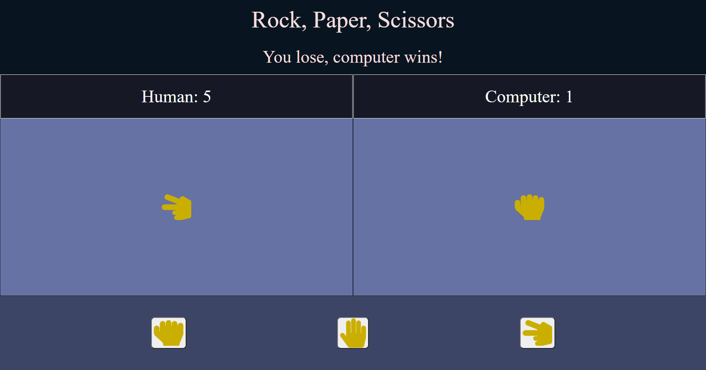

# Web Unit 1 Build Week Advanced Assignments

## Putting HTML, CSS, and JavaScript Together

## Objectives

- Improve your HTML, CSS, and JavaScript skills further with more real-world applications.
- Use DOM selectors and describe the differences in the behavior of each.
- Use different properties and methods to manipulate a selected element.
- Explain what events are in the browser window and how event listeners can listen for those events.
- Add event listeners and event handlers to elements.

## Introduction

This repository has four projects in it, all of which you will be building from scratch without direct prior instruction. It is expected that it will take you significant time and energy to think through how to implement these projects, so please spend a solid chunk of time working through several approaches before asking for hints or tips. They are all optional, and you do not have to complete them all this week. Feel free to continue working on them when you have free time if you'd like!

Before you start this assignment, spend some time reading about [the DOM on MDN](https://developer.mozilla.org/en-US/docs/Web/API/Document_Object_Model/Introduction) or any other resource you'd like. You will need these concepts in order to succeed in implementing these projects, and we have not yet gone over them. They will be discussed further in the first week of Unit 2, so learning them now will be a great leg up for you! The most important things to understand are the the DOM tree, selectors, and browser events. The rest of what you need to implement these, you already know!

The first project is a dark mode theme flipper. You will need to use selectors to capture HTML tags and alter the styles applied to those tags by triggering an event, usually a button click. Here's an [example](https://miro.medium.com/max/1400/1*_l0vaIoI0RQu9_io9pJJIw.gif).

The second project is a modal, or a popup window. You will need to set the popup window to be hidden by default, then apply styles to it when an event is triggered by clicking on a button or some other event of your choosing. You will also need to make the modal be able to close itself in some way. Here are some [examples](https://i0.wp.com/codemyui.com/wp-content/uploads/2015/12/cool-modal-animations.gif?fit=880%2C440&ssl=1) with nice animations.

The third project is a scroll progress bar. You will need to keep track of how far down the page you have scrolled out of the total length of the page, then fill up the bar based on that number as it changes. This will require you to use a scroll event. Here's an [example](https://vuejsexamples.com/content/images/2019/03/vue-scroll-progress.gif).

The fourth and final project is significantly more challenging than the rest- a game of rock, paper, scissors! You have already implemented the base logic of this game once before, but now we're going to attach a User Interface to it and keep track of the score count. The FontAwesome Rock/Paper/Scissor hand symbols are already embedded and available for you to use, so take advantage of the resource. Here's an example of what the solution code looks like! 

## Instructions

### Task 1: Set Up The Project With Git

Follow these steps to set up and work on your project:

- [ ] Create a forked copy of this project.
- [ ] Clone your OWN version of the repository: git clone git@github.com:bloominstituteoftechnology/web-unit-1-bw-advanced-assignments.git
- [ ] To open each project, drag the HTML file into your browser like a tab. [See here](https://www.youtube.com/watch?v=nqN_VPvMpW4) if needed.
- [ ] Implement the project, committing changes regularly: git commit -m "message goes here"
- [ ] Push commits: git push
 
### Task 2: Pick Your Task
The projects are recommended to do in the below order, but feel free to do them however you'd like if you want to do something different!

- [ ] Implement the Dark-Theme project
- [ ] Implement the Modal project
- [ ] Implement the Scroll-Progress-Bar project
- [ ] Implement the Rock-Paper-Scissors project

### Task 3: Stretch Goals

The following goals are designed to stretch your knowledge and may require additional research beyond what was learned in class today.

- [ ] Learn more about how the browser works and what the DOM is.
- [ ] Learn more about event propagation.
- [ ] Try creating a page entirely from elements you've created with JavaScript via the DOM.
- [ ] Explore the [React Documentation Website](https://reactjs.org/) and use the create-react-app script to create your first React project!
